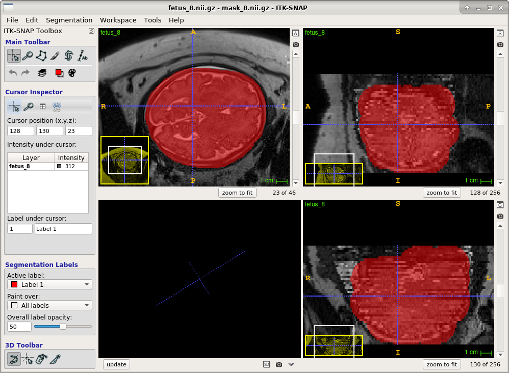

# T2 Fetal Recon Pipeline
The T2 recon pipeline is a set of instructions and scripts for going from raw T2 fetal data stacks to a super resolution 3D reconstruction (Gholipour et al. 2017). It's generally more efficient to run these steps for groups of images one section at a time. For example, first do Recon Setup for all scans, then run SVRTK for all scans, then do registration pre-processing for all scans, etc.
## Prequisites
- Be on a CRL server machine
- Processing machines Clemente has used include (all CentOS7): zephyr, boreas, auster, eurus, dingo, anchorage (Clemente's workstation). Ubuntu machines such as barnes, french, saadi, iced may work but I'm not sure. Try using bash script.sh instead of sh script.sh.
- Have this binary directory in your PATH: `/fileserver/fetal/software/bin`

The servers above should be ready to go. If getting set up on a new machine, you will need:
- Docker: https://docs.docker.com/engine/install/
- The SVRTK Docker image: https://github.com/SVRTK/svrtk-docker-gpu
- Davood's recon brain extraction docker: https://hub.docker.com/r/davoodk/brain_extraction

Helpful tools:
- ITK-SNAP (for viewing images and drawing/editing ROI's)
- detox (convenient tool to fix directory names with special characters)
## Data prep and setup
1. Pull data to CRL server. This step will most likely already be completed by Clemente. Only applies to scans performed at BCH. 
`sh retrieve-fetal.sh [MRN] [DOS] MR [OUTPUT DIRECTORY]`
2. Convert data from DICOM to NIFTI and set up recon directory: `sh prep-fetal.sh [RAW CASE DIR] [STUDY RECON DIR]`
This script will create a case processing folder in *STUDY RECON DIR* and place all T2 stacks in a subfolder *STUDY/CASEID/nii*. Henceforth this is referred to as the *recon directory*.
3. Check T2 stacks in the recon directory, archive bad stacks in *STUDY/CASEID/notgood*
- Stacks that do not have the entire brain should be archived
- Stacks in which the fetus changes orientation (from coronal to sagittal, for example) should be archived
- Oblique stacks should be archived if there are better stacks
- Only ~4-9 stacks are needed; if there are more they can be removed/ignored. 
5. Create rough mask or ROI for recon initialization, named *mask_x.nii.gz*, where "x" is the corresponding stack number. I normally do this in ITK-SNAP.

6. Generate SVRTK docker run script: `sh svrtk-gen.sh [recon directory]`
This script writes the SVRTK container command (*run-svrtk.sh*) to run the reconstruction. Looking at *recon directory*, it records all files named *fetus_\*nii.gz* as the inputs and a file named *mask_\*.nii.gz* to use as the ROI.
## Running the SVRTK reconstruction 
6. Method A) Script to run a single recon: `sh svrtk-exec.sh [recon directory]`
 OR Method B) Use this convenient script to search for all run-svrtk.sh files and run any for which the corresponding output cannot be found: `sh svrtk-allexec.sh [STUDY DIRECTORY]` 
*study directory* is the folder which holds all of the individual subject recon directories 
7. Check recon output. If necessary (recon is poor), change the stack selection and/or mask, and re-run SVRTK.

## Normalization and prep for atlas-space registration
8. Bias correct and generate a precise brain mask for the reconstructed image`sh reg-prep.sh -n 1 -m [SVRTK_subjID.nii.gz]` This script does the following:
- Makes a registration/ directory and copied the recon there
- -n 1 option runs a single iteration of N4 bias correction
- -m  Runs the Docker for Davood Karimi's Brain Extraction (outputs as registration/mask.nii.gz)
- Validate and correct *mask.nii.gz* by overlaying on *nxb\*.nii.gz* with ITK-SNAP
## Registration to atlas-space
9. Run the register script: `sh reg-fetal-recon.sh -m mask.nii.gz -n 2 -w [input]` The script registers the input image to atlas images of similar gestational age. It estimates gestational age by measuring the total  volume of the brain. 
- -m mask.nii.gz tells the script to crop the input using mask.nii.gz. If you already have a masked image you can omit this argument
- -n 2 tells the script to perform two more iterations of N4 intensity bias correction. Some data may not need bias correction
- -t [argument] can be used to specify a registration target:
  - ATLAS -- Fetal spatiotemporal atlas images. Default option.
  - CASES -- Individual subject atlases. These are more varied; useful when ATLAS fails.
  - EARLY -- A pre-selection of useful small brains (GA=17-22 weeks). Can use for the smallest/earliest brains, though the script will also detect when the input is very small and use these instead.
  - [any supplied image.nii.gz] -- Alternatively you can target a specific image
 - -w Matches plus/minus 1 week GA, instead of exact match.
 - -ga [GA] allows you to specify a gestational age instead of having the script estimate it 
10. Look through output registrations and choose the best one, then run: `sh choosereg.sh [best reg]` This copies the chosen registration as *atlas_t2final_CASEID.nii.gz* and throws out all other registration attempts[^1].

# Segmentation
14. Multi-atlas segmentation script for fetal data: `sh FetalAtlasSeg.sh [Imagelist] [OutputDir] [MaxThreads]` 
- Image list is a path list of post-processed T2 recons (as done above) with GA's, for example:
> /path/to/atlas_t2final_CASE001.nii.gz 34  /path/to/atlas_t2final_CASE002.nii.gz 22 /path/to/atlas_t2final_CASE003.nii.gz 29 /path/to/atlas_t2final_CASE004.nii.gz 37
- Default settings will reference full set of atlas images and individual subject atlases (ISA's) and use the *"GEPZ"* and *"region"* segmentation schemes
- Runs partial volume correction (PVC) on the *GEPZ segmentation* 
- -f option runs Haoran's DL CP segmentation

[^1]: Sometimes it's hard to get a good registration. In these cases, we can run a second iteration of the registration. If you do this, there is an additional script to compose the part 1 and part 2 transforms into a single registration. Example: bmnxbSVRTK_subjID_FLIRTto_fxs1.nii.gz is used to create bmnxbSVRTK_subjID_FLIRTto_fxs1_FLIRTto_fys1.nii.gz. Run the script: `sh combineTransforms-t2pipeline.sh bmnxbSVRTK_subjID_FLIRTto_fxs1_FLIRTto_fys1.nii.gz` This generates bmnxbSVRTK_subjID_FLIRTto_STA.nii.gz and bmnxbSVRTK_subjID_FLIRTto_STA.tfm. You can then safely use `sh choosereg bmnxbSVRTK_subjID_FLIRTto_STA.nii.gz
