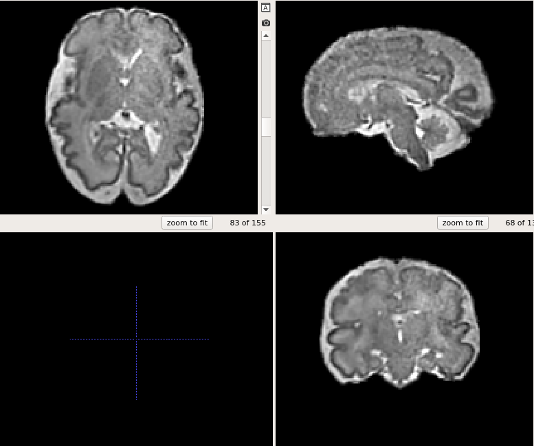

# T2 Fetal Recon Pipeline
The T2 recon pipeline is a set of instructions and scripts for going from raw T2 fetal data stacks to a super resolution 3D reconstruction (Gholipour et al. 2017). It's generally more efficient to run these steps for groups of images one section at a time. For example, first do Recon Setup for all scans, then run SVRTK for all scans, then do registration pre-processing for all scans, etc.
## Prequisites
- Source CRkit in your bash profile
  
    Something like: `source /lab-share/Rad-Warfield-e2/Groups/fetalmri/software/crkit/bin/crkit-env.sh`
    
- Have the fetal processing pipeline binary directory in your FETALBIN: `export FETALBIN=/lab-share/Rad-Gholipour-e2/Public/fetalmri/software/bin`
- Apptainer/Singularity https://apptainer.org/ or Docker: https://docs.docker.com/engine/install/

Helpful tools:
- ITK-SNAP (for viewing images and drawing/editing ROI's)
- detox (convenient tool to fix directory names with special characters)

## Data prep and setup
1. Pull data to CRL server. Only applies to scans on BCH PACS.
 
    `sh retrieve-par.sh -a -n [MRN] [DOS] [OUTPUT DIRECTORY]`
  > `-a` Tells the script to not use patient MRN/exam accession in the folder names
  >   `-n` Puts the output files directory in OUTPUT DIRECTORY, instead of sorting by exam (obviously, don't do this if you do want the script to sort by visit ID)
2. Convert data from DICOM to NIFTI and set up recon directory:

    `sh prep-fetal.sh [RAW CASE DIR] [STUDY RECON DIR]` 
    This script will create a case processing folder in *STUDY RECON DIR* and place all T2 stacks in a subfolder *STUDY/CASEID/svrtk*. Henceforth this is referred to as the *recon directory*.
1. Check T2 stacks in the recon directory, archive bad stacks in *STUDY/CASEID/notgood*
    - Stacks that do not have the entire brain should be archived
    - Stacks in which the fetus changes orientation (from coronal to sagittal, for example) should be archived
    - Oblique stacks should be archived if there are better stacks
    - Only ~4-9 stacks are needed; if there are more they can be removed/ignored.
1. Process reconstruction with either SVRTK or Niftymic  
## Reconstruction with SVRTK
1. Create a rough ROI for reconstruction, named *mask_x.nii.gz*, where "x" is the corresponding stack number. I do this in ITK-SNAP. 

1. Generate SVRTK docker run script: `sh svrtk-gen.sh [recon directory]`
This script writes the SVRTK container command (*run-svrtk.sh*) to run the reconstruction. It records all files named *fetus_\*nii.gz* in `[recon directory]` as the inputs and a file named *mask_\*.nii.gz* to use as the ROI.
1. Execute the run script
- Method A) Script to run a single recon: `sh svrtk-exec.sh -s [recon directory]`
  - `-s` option uses Singularity rather than Docker. While on the e2 server, you must use Singularity.
- Method B) Use the convenience to run all run-svrtk.sh files in subdirectories for unfinished recons: `sh svrtk-allexec.sh [STUDY DIRECTORY]`

- Check recon output. If necessary (recon is poor), change the stack selection and/or mask, and re-run reconstruction.

## Normalization and prep for atlas-space registration
- Bias correct and generate a precise brain mask for the reconstructed image`sh reg-prep.sh -n 1 -m [SVRTK_subjID.nii.gz]` This script does the following:
  - Makes a registration/ directory and copied the recon there
  - -n 1 option runs a single iteration of N4 bias correction
  - -m  Runs the Docker for Davood Karimi's Brain Extraction (outputs as registration/mask.nii.gz)
  - - When on the RC cluster, use `-s` instead of `-m` (uses Apptainer instead of Docker)
  - Validate and correct *mask.nii.gz* by overlaying on *nxb\*.nii.gz* with ITK-SNAP
## Registration to atlas-space
1. Run the register script: `sh reg-fetal-recon.sh -m mask.nii.gz -n 2 -w [input]`

    This script registers the input image to atlas images of similar gestational age. It estimates gestational age by measuring the total  volume of the brain.
  > -m mask.nii.gz tells the script to crop the input using mask.nii.gz. If you already have a masked image you can omit this argument
  >  -n 2 tells the script to perform two more iterations of N4 intensity bias correction. Some data may not need bias correction
  >  -t [argument] can be used to specify a registration target:
  >  &nbsp;&nbsp;&nbsp;&nbsp;ATLAS -- Fetal spatiotemporal atlas images. Default option.
  >  &nbsp;&nbsp;&nbsp;&nbsp;CASES -- Individual subject atlases. These are more varied; useful when ATLAS fails.
  >  &nbsp;&nbsp;&nbsp;&nbsp;EARLY -- A pre-selection of useful small brains (GA=17-22 weeks). Can use for the smallest/earliest brains, though the script will also detect when the input is very small and use these instead.
  >  &nbsp;&nbsp;&nbsp;&nbsp;[any supplied image.nii.gz] -- Alternatively you can target a specific image
  >  -w Matches plus/minus 1 week GA, instead of exact match.
  >  --ga [GA] allows you to specify a gestational age instead of having the script estimate it
2. Look through output registrations and choose the best one, then run: `sh choosereg.sh [best reg].nii.gz` This copies the chosen registration as *atlas_t2final_CASEID.nii.gz* and throws out all other registration attempts.
The output registration should be orthogonal and have axial, coronal, sagittal arranged like the below example.

# Reconstruction with Niftymic 
Niftymic is more self-sufficient, featuring built-in pipelines to run some of the steps above without user input, including atlas registration. The image quality is also pretty good. The downside of Niftymic is that it's slower and harder to troubleshoot problems with individual scans.
1. Make a niftymic folder in the same place you would make the "svrtk" folder, with "t2" and "mask" subfolders (prep-fetal.sh currently takes all HASTE scans and places them  in t2/)
- `mkdir -pv STUDY/CASEID/niftymic/{t2,mask}`
1. Copy the t2 stacks you want to reconstruct to the `niftymic/t2` folder
1. `sh nm-gen.sh STUDY/CASEID/niftymic` to make the run scripts (separate scripts generated for stack brain masking (`run-sfb.sh` and recon pipeline `run-nm.sh`)
1. `sh nm-exec.sh -s STUDY/CASEID/niftymic` to run the pipeline. That's it!
1. Note that Niftymic does not produce a final, masked reconstruction. You will need to do this yourself.
- `[study folder] $ sh collectNM.sh [input list of CASEID's to pull]`

# Reconstruction with [NeSVoR]([https://github.com/daviddmc/NeSVoR)
NeSVoR performs GPU accelerated SVR. By default the resulting reconstruction is in atlas space. You may need to run a registration afterwards to improve alignment.
1. Put the T2 stacks for reconstruction in a directory `mkdir -pv STUDY/CASEID/nesvor`
1. Run the container `sh nesvor.sh -s STUDY/CASEID/nesvor`
1. Refine registration `sh reg-fetal-recon.sh -w STUDY/CASEID/nesvor/nesvor.nii.gz`
1. Choose best alignment `sh choosereg.sh [best reg].nii.gz`

# Segmentation
- Multi-atlas segmentation script for fetal data: `sh FetalAtlasSeg.sh [Imagelist] [OutputDir] [MaxThreads]` 
  - Image list is a path list of post-processed T2 recons (as done above) with GA's, for example:
  > /path/to/atlas_t2final_CASE001.nii.gz 34  /path/to/atlas_t2final_CASE002.nii.gz 22 /path/to/atlas_t2final_CASE003.nii.gz 29 /path/to/atlas_t2final_CASE004.nii.gz 37
  - Default settings will reference full set of atlas images and individual subject atlases (ISA's) and use the *"GEPZ"* and *"region"* segmentation schemes
  - Runs partial volume correction (PVC) on the *GEPZ segmentation* 
  - -f option runs Haoran's DL CP segmentation

# FAQ / Troubleshooting
## Help! Registration is not working.
Sometimes the initial registration does not succeeed. I have a few strategies for approaching these cases:
1. Re-run registration with `-t cases` to increase the number of registration targets
1. For very small brains, re-run registration with `-t early`
1. Run a second iteration of the registration. So:  
`sh reg-fetal -w bmnxbSVRTK_subjID_FLIRTto_fxs1.nii.gz` Then, we take the twice-registered image and combine the part 1 and part 2 transforms: `sh combineTransforms-t2pipeline.sh bmnxbSVRTK_subjID_FLIRTto_fxs1_FLIRTto_fys1.nii.gz` This generates bmnxbSVRTK_subjID_FLIRTto_STA.nii.gz and bmnxbSVRTK_subjID_FLIRTto_STA.tfm. You can then safely use `sh choosereg.sh bmnxbSVRTK_subjID_FLIRTto_STA.nii.gz`

The latter (#3) is likely the best option in terms of quality and consistency.

## Bash error: "[[: not found"
This happens on Ubuntu sometimes. Try calling the script with `bash script.sh` instead of `sh script.sh`

## WARNING: FSLOUTPUTTYPE environment variable is not set.
If using FSL on the cluster, the installed version requires this variable to be set.
In your .bashrc, add the following line:
`export FSLOUTPUTTYPE=NIFTI_GZ`

## Niftymic failures
If Niftymic reconstruction has failed spectacularly, or if the signal looks good but is blocked off by black bars, the stack brain masking may be at fault.
You can look at and edit the mask files found in niftymic/mask, for example:
`is -g t2/fetus_10.nii.gz -s mask/fetus_10.nii.gz`
Make sure the file permissions of the mask folder allow you to write, since Docker saves things as the root user. You may also want to back up your edited files.
Once ready, simply clear the `ssr` output folder and re-run nm-exec.sh. It will see the mask_* files already exist and skip the stack segmentation step.
You could also insert your own brain masks, made completely by another program this way.

# Flywheel Data Management (deprecated)
flywheel-*.sh scripts are used to manage data downloads from FlyWheel.
- `flywheel-sync.sh` is the sync command for the e2 copy of the flywheel projects. This command seems broken and flywheel IT hasn't been able to help me. I recommend using `flywheel-dl.sh` instead
- `flywheel-dl.sh` downloads a specified dataset to a tar file. Unpack with `tar -xvf download.tar`.
- `flywheel-add.sh` is a convenience script. After unpacking a downloaded scan (which will be in a folder named `scitran`), run `sh flywheel-add.sh scitran/study/subject/scan` to copy the files over to the master directory on e2. Automates two scripts:
- - `flywheel-unzip.sh`, which unpacks the .zip files in which flywheel transmits the files 
- - `flywheel-raw.sh`, which matches the e2 flywheel directory with the e2 dicom directory
